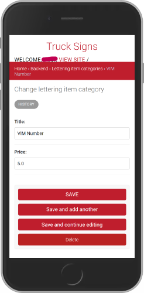
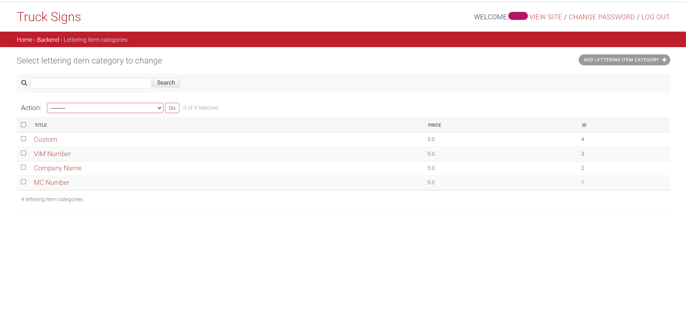

<div align="center">

# Signs for Trucks

  


__Signs for Trucks__ is an online store to buy pre-designed vinyls with custom lines of letters (often called truck letterings).
The store also allows clients to upload their own designs and to customize them on the website as well.

</div>

## Table of Contents

- [Signs for Trucks](#signs-for-trucks)
  - [Table of Contents](#table-of-contents)
  - [Quickstart](#quickstart)
    - [Prerequisites](#prerequisites)
    - [Steps](#steps)
  - [Project Goal](#project-goal)
  - [Usage](#usage)
    - [Configuration](#configuration)
    - [Building the Container Image](#building-the-container-image)
    - [Running a Single Container Manually](#running-a-single-container-manually)
    - [Local Development (without Docker)](#local-development-without-docker)
    - [Settings](#settings)
    - [Models](#models)
    - [Brief Explanation of the Views](#brief-explanation-of-the-views)
  - [Features](#features)
  - [Environment Variables](#environment-variables)
  - [CI/CD](#cicd)
  - [Screenshots of the Django Backend Admin Panel](#screenshots-of-the-django-backend-admin-panel)
    - [Mobile View](#mobile-view)
    - [Desktop View](#desktop-view)
  - [Additional Files](#additional-files)
  - [Additional Information](#additional-information)
    - [Postgresql Database](#postgresql-database)
    - [Docker](#docker)
    - [Django and DRF](#django-and-drf)
    - [Miscellaneous](#miscellaneous)

## Quickstart

### Prerequisites

* Docker and Docker Compose

### Steps

1. Clone the repo:
```bash
   git clone https://github.com/Gerth123/truck-signs-api.git
   cd truck-signs-api
```
2. Copy the content of the `example.env` file into a `.env` file and fill in your own values:
```bash
   cp example.env .env
```
3. Build the application image:
```bash
   docker build -t truck-signs-api:latest .
```
   `docker-compose.yml` references this image by name rather than building it inline, so this step must run before `docker compose up`.
4. Start the stack:
```bash
   docker compose up
```
5. Open the admin panel at `http://localhost:8020/admin/` and log in with the superuser credentials configured in your `.env`.

## Project Goal

This repository provides the backend API for Signs for Trucks, an online store for pre-designed and custom truck vinyl letterings. It is built with Django and Django REST Framework, uses PostgreSQL for persistent storage in production, and Cloudinary for media file storage. The project is containerized using Docker and orchestrated with Docker Compose for a reproducible, production-ready setup.

## Usage

### Configuration

The application is configured entirely through environment variables, loaded from a `.env` file at the repository root (see [Environment Variables](#environment-variables)). Copy `example.env` to `.env` and fill in the required values before running the app in any mode.

**Database switch via `MODE`:**
- `MODE=prod` → PostgreSQL, using `DB_NAME`, `DB_USER`, `DB_PASSWORD`, `DB_HOST`, `DB_PORT` from `.env`.
- `MODE` unset or `MODE=dev` → SQLite at `src/db.sqlite3`; no DB env vars needed.

When running via Docker Compose, both the `backend` and `db` services read their configuration from the same `.env` file via `env_file`, and `DB_HOST` must be set to `db` (the service name), not `localhost`.

### Building the Container Image

The `Dockerfile` installs dependencies, copies the project into the image, and sets its working directory to `src/`, so all commands inside the container (`manage.py`, `gunicorn`) run without needing a `src/` prefix. Build it with:

```bash
docker build -t truck-signs-api:latest .
```

`docker-compose.yml` references this pre-built image (`truck-signs-api:latest`) rather than building inline, so rebuild the image manually whenever the source code changes before running `docker compose up`.

### Running a Single Container Manually

To run the backend container by itself (for example, against an already running database), replace the placeholders below with your own values:

```bash
docker run -d \
  --name truck-signs-api \
  --network truck-signs-api_default \
  -p 8020:8000 \
  -e MODE=prod \
  -e SECRET_KEY=<your-secret-key> \
  -e DB_NAME=<your-db-name> \
  -e DB_USER=<your-db-user> \
  -e DB_PASSWORD=<your-db-password> \
  -e DB_HOST=db \
  -e DB_PORT=5432 \
  -e DJANGO_SUPERUSER_USERNAME=<your-admin-username> \
  -e DJANGO_SUPERUSER_EMAIL=<your-admin-email> \
  -e DJANGO_SUPERUSER_PASSWORD=<your-admin-password> \
  truck-signs-api:latest
```

### Local Development (without Docker)

1. Clone the repo:
```bash
   git clone https://github.com/Gerth123/truck-signs-api.git
   cd truck-signs-api
```
2. Copy the content of the example.env file into a .env file:
```bash
   cp example.env .env
```
3. Create virtual environment:
```bash
   python -m venv <venv_name>
```
4. Activate virtual environment:
```bash
   source <venv_name>/scripts/activate
```
5. Install requirements:
```bash
   pip install -r requirements.txt
```
6. Migrate database:
```bash
   python src/manage.py makemigrations
   python src/manage.py migrate
```
7. Collect static files:
```bash
   python src/manage.py collectstatic
```
8. Start the Python Development Server:
```bash
   python src/manage.py runserver
```

With `MODE` unset or `MODE=dev`, this uses SQLite and requires no database setup.

### Settings

The `settings.py` file inside the `src/tsa_app` folder contains the different settings configuration for the application. The `example.env` file in the project root gives an overview of the configuration values that can be set for the app.

### Models

Most of the models do what can be inferred from their name. The following notes clarify the purpose of some of them:
- __Category Model:__ The category of the vinyls in the store. It contains the title of the category as well as the basic properties shared among products that belong to the same category. For example, _Truck Logo_ is a category for all vinyls that have a truck logo plus some lines of lettering (the vinyls themselves are instances of the _Product_ model). Another category is _Fire Extinguisher_, for all vinyls with a fire extinguisher logo.
- __Lettering Item Category:__ The category of the lettering, for example: _Company Name_, _VIN Number_, etc. Each has different pricing.
- __Lettering Item Variations:__ Contains a foreign key to the __Lettering Item Category__ and the text added by the client.
- __Product Variation:__ Has the original product as a foreign key, plus the lettering lines (instances of __Lettering Item Variations__) added by the client.

### Brief Explanation of the Views

Most views are CBVs imported from `rest_framework.generics`, allowing the backend API to perform basic CRUD operations, inheriting from `ListAPIView`, `CreateAPIView`, `RetrieveAPIView`, and so on.

Some views were modified to address functionality such as order creation and payment, implemented in the same view by inheriting from `GenericAPIView`. Another example is the `UploadCustomerImage` view, which takes the vinyl template uploaded by clients and creates a new product based on it.

> [!NOTE]
> To create Truck vinyls with Truck logos in them, first create the __Category__ Truck Sign, and then the __Product__ (can have any name). This is to make sure the frontend retrieves the Truck vinyls for display in the Product Grid, as it only fetches products of the category Truck Sign.

## Features

- REST API for managing truck sign and vinyl products, built with Django REST Framework
- PostgreSQL persistence in production, with data surviving container restarts via a named Docker volume
- Media file storage via Cloudinary, configurable through environment variables
- Static file serving via WhiteNoise
- CORS configuration for frontend integration
- Idempotent superuser creation on container startup, safe to run on repeated deployments

## Environment Variables

| Variable | Description |
|---|---|
| `MODE` | `dev` (SQLite, debug on) or `prod` (PostgreSQL, debug off) |
| `DEBUG_ENABLED` | Overrides debug mode explicitly if needed |
| `SECRET_KEY` | Django secret key |
| `ALLOWED_HOSTS` | Comma-separated list of allowed hosts |
| `DB_NAME` | PostgreSQL database name (Django-side) |
| `DB_USER` | PostgreSQL user (Django-side) |
| `DB_PASSWORD` | PostgreSQL password (Django-side) |
| `DB_HOST` | Database host, must be `db` when using Docker Compose |
| `DB_PORT` | Database port, default `5432` |
| `POSTGRES_DB` | Database name (used by the official Postgres image on first init) |
| `POSTGRES_USER` | Database user (used by the official Postgres image on first init) |
| `POSTGRES_PASSWORD` | Database password (used by the official Postgres image on first init) |
| `DJANGO_SUPERUSER_USERNAME` | Username for the automatically created superuser |
| `DJANGO_SUPERUSER_EMAIL` | Email for the automatically created superuser |
| `DJANGO_SUPERUSER_PASSWORD` | Password for the automatically created superuser |
| `CLOUD_NAME` | Cloudinary cloud name |
| `CLOUD_API_KEY` | Cloudinary API key |
| `CLOUD_API_SECRET` | Cloudinary API secret |
| `CORS_ALLOWED_ORIGINS` | Comma-separated list of allowed CORS origins |
| `EMAIL_HOST_USER` | SMTP username for outgoing email |
| `EMAIL_HOST_PASSWORD` | SMTP password for outgoing email |

`POSTGRES_DB`, `POSTGRES_USER`, and `POSTGRES_PASSWORD` must match `DB_NAME`, `DB_USER`, and `DB_PASSWORD` respectively, since the official Postgres image uses the former to initialize the database while Django connects using the latter.

## CI/CD

The repository includes three GitHub Actions workflows:

- **Lint and Test Python Code Base**: runs `flake8`, `black`, and `isort` checks, then runs the Django test suite, on pushes and pull requests affecting Python files.
- **Build Application**: builds and pushes the Docker image to GitHub Container Registry on tag pushes.
- **Check open PR for feature branch**: verifies that an open pull request exists for the current branch.

See [docs/testing.md](./docs/testing.md) for details on the linting and formatting setup.

## Screenshots of the Django Backend Admin Panel

### Mobile View

<div style="padding: 0 5rem; width: 100%;  display: flex; gap: 5rem; justify-content: center; flex-wrap: wrap;">




</div>

### Desktop View

<div style="padding: 0 5rem; width: 100%; display: flex; flex-direction: column; gap: 2rem; align-items: center; justify-content: center;">





</div>

## Additional Files

- `.gitattributes`: enforces LF line endings for `entrypoint.sh` to avoid shebang failures on Windows checkouts.
- `example.env`: template listing all environment variables required to run the project; copy to `.env` and fill in your own values.
- `Procfile`: process declaration for platform-as-a-service deployment (e.g. Heroku-style), not used by the Docker Compose setup in this repository.
- `pyproject.toml`: shared configuration for `black`, `isort`, and `flake8`, used by the linting CI workflow.
- `docs/testing.md`: documents the linting and formatting setup (`flake8`, `isort`, `black`) and the CI testing pipeline in more detail.
- `docs/Truck Signs API v2 Checkliste.pdf`: the original project submission checklist provided by Developer Akademie, kept for reference.

## Additional Information

### Postgresql Database

- Setup Database: [Digital Ocean Link for Django Deployment on VPS](https://www.digitalocean.com/community/tutorials/how-to-set-up-django-with-postgres-nginx-and-gunicorn-on-ubuntu-16-04)

### Docker

- [Docker Official Documentation](https://docs.docker.com/)
- Dockerizing Django, PostgreSQL, gunicorn, and Nginx:
    - Github repo of sunilale0: [Link](https://github.com/sunilale0/django-postgresql-gunicorn-nginx-dockerized/blob/master/README.md#nginx)
    - Michael Herman article on testdriven.io: [Link](https://testdriven.io/blog/dockerizing-django-with-postgres-gunicorn-and-nginx/)

### Django and DRF

- [Django Official Documentation](https://docs.djangoproject.com/en/5.2/)
- Generate a new secret key: [Stackoverflow Link](https://stackoverflow.com/questions/41298963/is-there-a-function-for-generating-settings-secret-key-in-django)
- Modify the Django Admin:
    - Small modifications (add searching, columns, ...): [Link](https://realpython.com/customize-django-admin-python/)
    - Modify Templates and css: [Link from Medium](https://medium.com/@brianmayrose/django-step-9-180d04a4152c)
- [Django Rest Framework Official Documentation](https://www.django-rest-framework.org/)
- More about Nested Serializers: [Stackoverflow Link](https://stackoverflow.com/questions/51182823/django-rest-framework-nested-serializers)
- More about GenericViews: [Testdriver.io Link](https://testdriven.io/blog/drf-views-part-2/)

### Miscellaneous

- Create Virtual Environment with Virtualenv and Virtualenvwrapper: [Link](https://docs.python-guide.org/dev/virtualenvs/)
- [Configure CORS](https://www.stackhawk.com/blog/django-cors-guide/)
- [Setup Django with Cloudinary](https://cloudinary.com/documentation/django_integration)